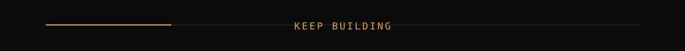

<div align="center">



<br>

**Software developer. Systems thinker. Relentless builder.**

`C` · `C#` · `C++` · `.NET`

</div>

---

## `>_` ABOUT

I like software that earns its complexity.

My home base is **C, C# and C++**, with **.NET** as the framework I reach for when an idea needs to become a real system. I’m interested in the part of development where a blank screen turns into something people can actually use.

No buzzwords. No trophy cabinet. Just code, curiosity, and the next thing worth building.

---

## `./stack --verbose`

```text
LANGUAGES     C              ██████████  low-level foundations
              C#             ██████████  application work
              C++            ██████████  systems & performance

FRAMEWORK     .NET           ██████████  the main workshop

MINDSET       understand → design → build → break → improve
```

---

## `cat /education`

**The Nairobi National Polytechnic**  
*Information and Communication Technology · 2021—2023*

I left with a **Credit** — and considerably more questions than I started with.

---

## `./next-project`

The most interesting project is usually the one that does not exist yet.

If you’re building something ambitious, solving an oddly specific problem, or simply want to talk code, **open an issue, start a discussion, or reach out.**

<div align="center">

[ **ENTER THE WORKBENCH →** ](https://github.com/mohammednan27?tab=repositories)

<br><br>



</div>

---

<div align="center">

<sub>Built with plain Markdown, SVG, and an unreasonable amount of curiosity.</sub>

</div>
